# Book Tracker Frontend

Sistema de gestión de libros, autores y préstamos. 
Este frontend en Angular consume el backend basado en microservicios.

## Características
- Gestión de libros, autores y préstamos
- Diseño moderno con Bootstrap

---

## Capturas de Pantalla  
### Página Principal  
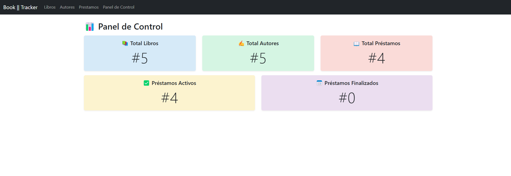

### Gestión de Autores  
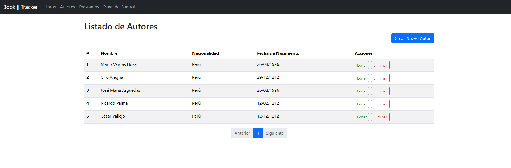
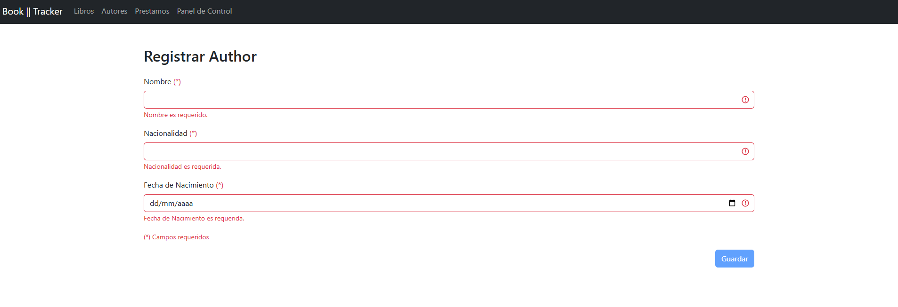
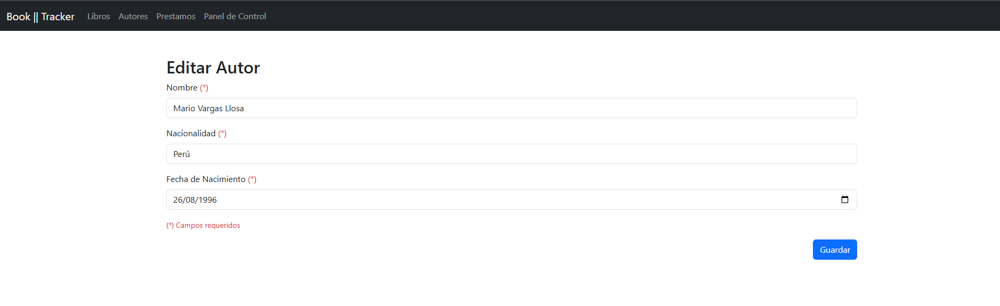
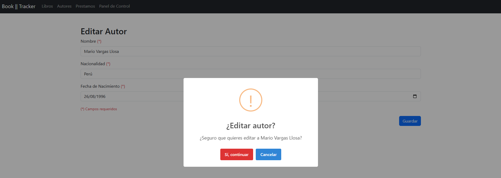
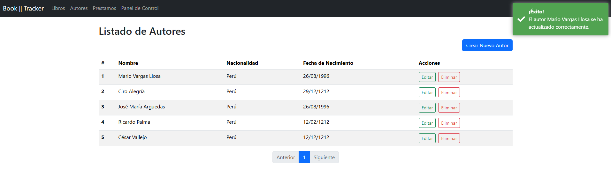  

### Gestión de Libros  
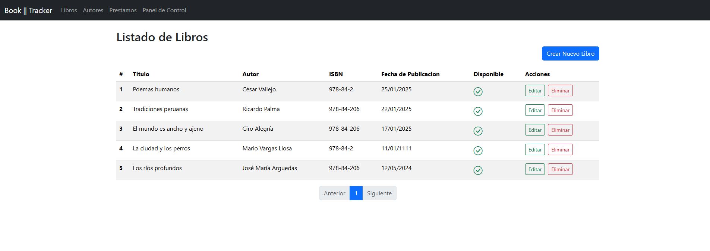
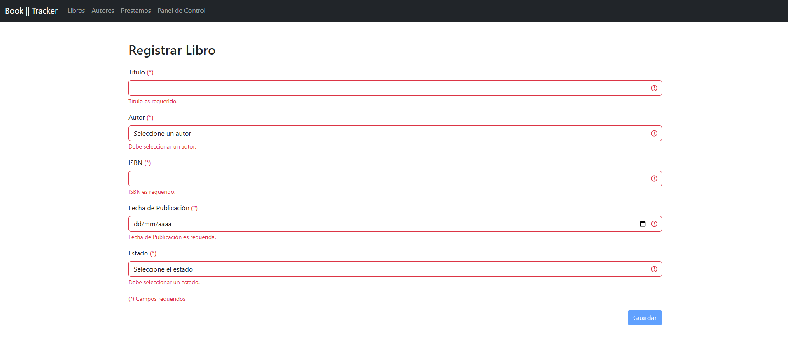
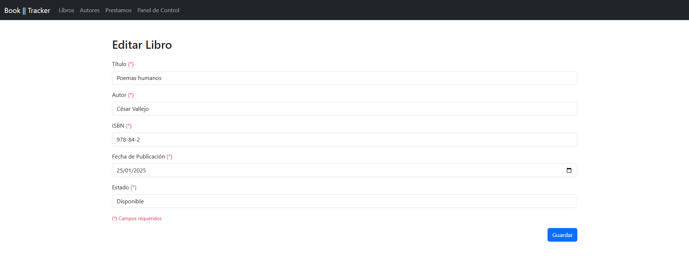

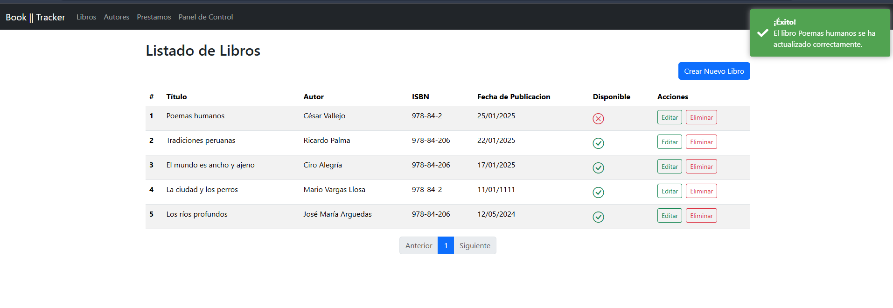 

### Gestión de Préstamos  
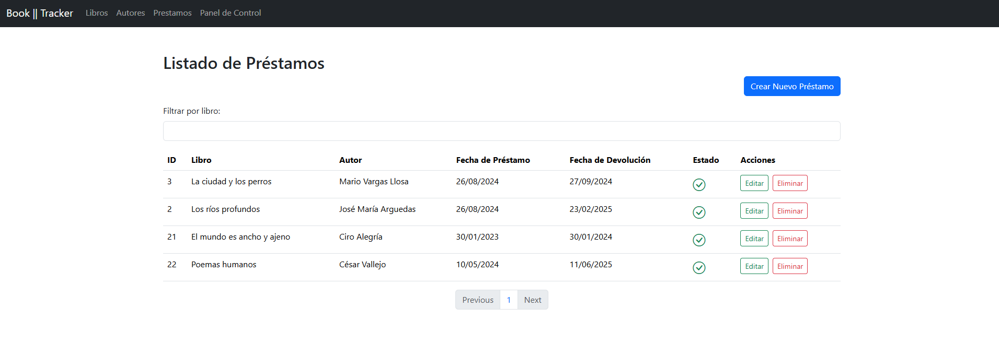
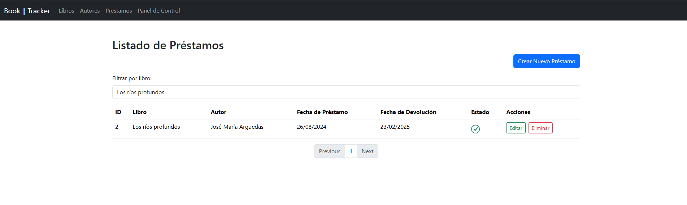
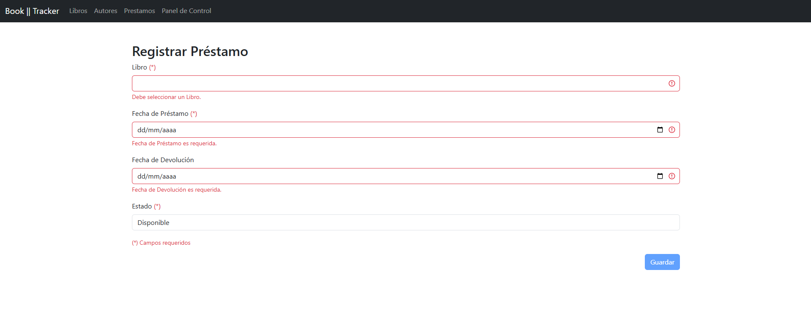
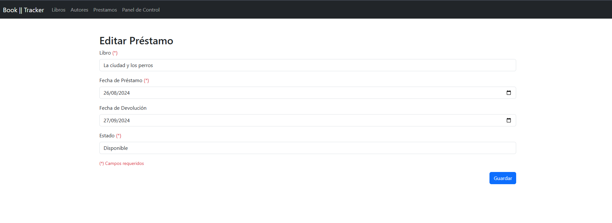
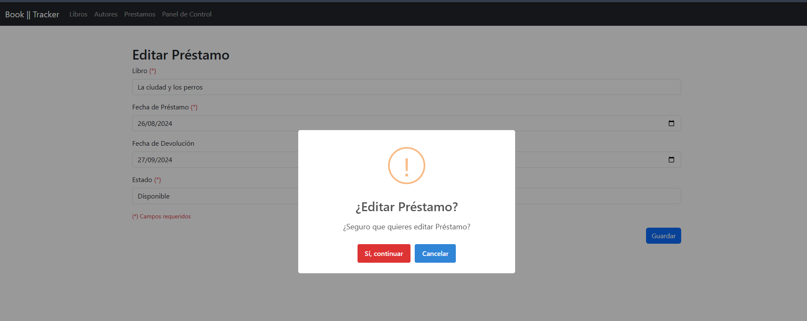
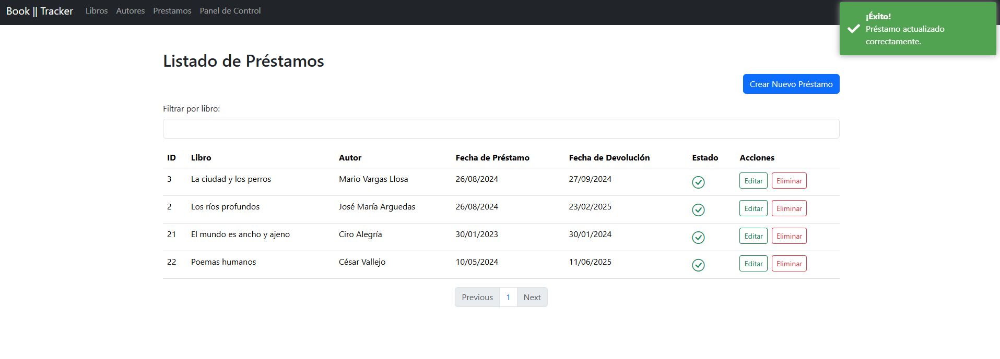 
 

---

## 📥 Instalación y Configuración
1. Clona el repositorio:
   ```bash
   git clone https://github.com/tu-usuario/book-tracker-frontend.git
   cd book-tracker-frontend
